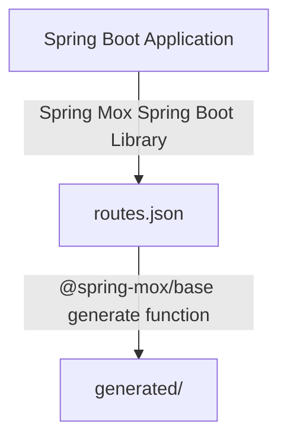

# Spring Mox
Frontend call generation from Spring Boot routes.

## Why?

I got tired of needing to have entire OpenAPI spec generated, together with need to use a third party OpenAPI to TypeScript generator.

## How does it work?

The workflow is simple. You first generate `routes.json` file on startup using Spring Mox library and then you use Spring Mox NPM package to convert it to TS calls.

## Setup

## License

Licensed under [MIT License](LICENSE).