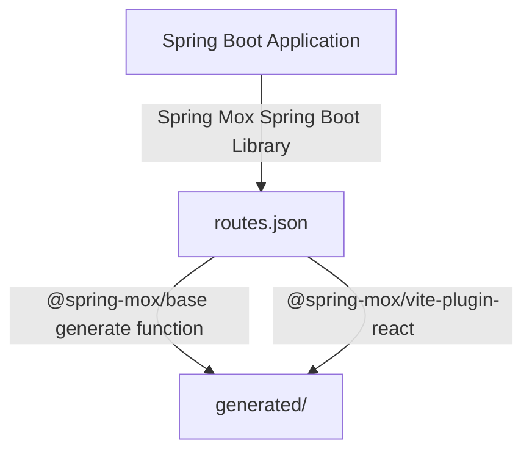

# Spring Mox
Frontend call generation from Spring Boot routes.

## Why?

I got tired of needing to have entire OpenAPI spec generated, together with need to use a third party OpenAPI to TypeScript generator.

## How does it work?

The workflow is simple. You first generate `routes.json` file on startup using Spring Mox library, and then you use Spring Mox NPM package to convert it to TS calls. If you're on Vite, the Vite plugin wraps that step and runs it for you on every config resolve.



## Packages

This is a [Bun workspace](https://bun.sh/docs/install/workspaces) monorepo with three parts:

| Package | What it is |
| :--- | :--- |
| [Spring Boot library](./src/main/kotlin/dev/aa55h/spring/mox) (`dev.aa55h:spring-mox`) | Emits `routes.json` from your Spring WebMvc app |
| [`@spring-mox/base`](./spring-mox-base) | Generates type-safe TS routes/fetch/tanstack-query calls from `routes.json` |
| [`@spring-mox/vite-plugin-react`](./spring-mox-vite-plugin) | Vite plugin that runs `@spring-mox/base` generation on config resolve |

Biome (lint/format) is configured once at the repo [root](./biome.json) and applies to both TS packages.

## Usage

### Spring Boot library (the thing which generates `routes.json`)

- Add as dependency from Maven Central: `implementation("dev.aa55h:spring-mox:0.1.0")` (or Maven equivalent)
- Consult [MoxConfigurationProperties](src/main/kotlin/dev/aa55h/spring/mox/MoxAutoConfiguration.kt) for further configuration. The default configuration generates `routes.json` in current working directory.

Configuration is under the `mox` prefix:

| Property | Type | Default | Description |
| :--- | :--- | :--- | :--- |
| `mox.enabled` | `Boolean` | `true` | Whether route generation runs at all |
| `mox.output-path` | `String` | `./routes.json` | Where `routes.json` gets written |
| `mox.packages` | `List<String>` | `[]` (empty = match all controllers, including default `/error`) | Restricts route scanning to given packages |
| `mox.prefixes.path` | `String` | `path:` | Cache key prefix for path parameters |
| `mox.prefixes.query` | `String` | `query:` | Cache key prefix for query parameters |

```yaml
mox:
  enabled: true
  output-path: ./routes.json
  packages:
    - dev.example.myapp.controller
  prefixes:
    path: "path:"
    query: "query:"
```

### TypeScript library

- Add NPM library - `@spring-mox/base`
- Consult [index.ts](./spring-mox-base/src/index.ts) for options in `generate` function.

### Vite plugin

- Add NPM library - `@spring-mox/vite-plugin-react`
- See the [package README](./spring-mox-vite-plugin/README.md) for setup and options.

## Development

This repo requires [Bun](https://bun.sh/). From the root:

```sh
bun install     # installs deps for both TS packages
bun run lint     # biome check across the workspace
bun run typecheck # typecheck both TS packages
```

## License

Licensed under [MIT License](LICENSE).