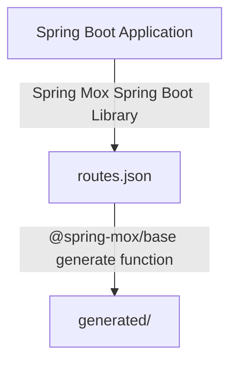

# Spring Mox
Frontend call generation from Spring Boot routes.

## Why?

I got tired of needing to have entire OpenAPI spec generated, together with need to use a third party OpenAPI to TypeScript generator.

## How does it work?

The workflow is simple. You first generate `routes.json` file on startup using Spring Mox library and then you use Spring Mox NPM package to convert it to TS calls.

## Usage

### Spring Boot library (the thing which generates `routes.json`)

- Add as dependency from Maven Central: `tbd`
- Consult [MoxConfigurationProperties](./src/main/kotlin/dev/aa55h/spring/mox/MoxConfigurationProperties.kt) for further configuration. The default configuration generates `routes.json` in current working directory.

### TypeScript library

- Add NPM library - `@spring-mox/base`
- Consult [index.ts](./spring-mox-base/src/index.ts) for options in `generate` function.

## License

Licensed under [MIT License](LICENSE).